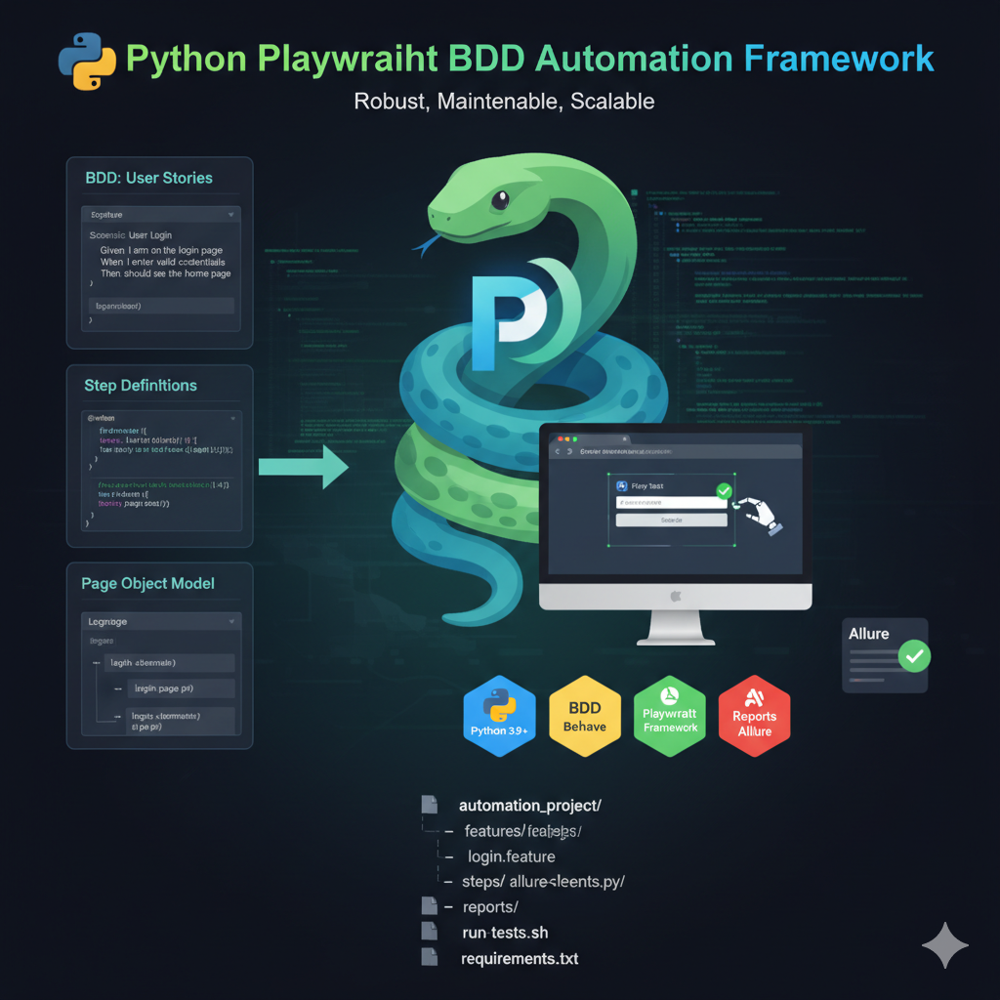

🐍 Python Playwright BDD Automation Framework
A robust, maintainable, and scalable Behavior-Driven Development (BDD) framework built with Python, Playwright, and the Page Object Model (POM) pattern.

🎯 Project Goal
The primary goal of this repository is to serve as a professional practice portfolio demonstrating proficiency in modern E2E testing techniques. It focuses on maximizing test coverage of critical user paths while prioritizing code maintainability and readability through the BDD approach.

⚙️ Prerequisites
Before running the tests, ensure you have the following installed:

Python: Version 3.9 or higher.

Homebrew (macOS/Linux): Required for installing Allure CLI.

🚀 Installation & Setup
1. Clone the Repository
git clone (https://github.com/lonnynarvaezqa/python-playwright-bdd-framework)
cd automation_project

2. Set Up the Virtual Environment
Using a virtual environment is mandatory to isolate dependencies:

# Create and activate the virtual environment
python3 -m venv .venv
source .venv/bin/activate  # On Windows, use: .venv\Scripts\activate

3. Install Python Dependencies
Install all project packages, including Playwright, Behave, and Allure integration:

pip install -r requirements.txt

4. Install Playwright Browsers
Install the necessary browser drivers (Chromium, Firefox, WebKit):

playwright install

5. Install Allure Reporting Tool (CLI)
Install the command-line tool required to generate the final HTML reports:

# For macOS/Linux users with Homebrew:
brew install allure

▶️ How to Run Tests
All tests are configured to run in non-headless mode (headless=False) for maximum visibility during execution and demonstration.

Run the Full Test Suite and Generate Report (Recommended)
Use the included script to run all scenarios and automatically compile and open the latest Allure HTML report.

./run_tests.sh

Run a Specific Feature (Example)
To run only the Login feature:

behave features/login.feature -f allure_behave.formatter:AllureFormatter -o allure-results
allure generate allure-results --clean -o allure-report
allure open allure-report

📂 Project Structure and Design
The framework is architected for maximum clarity and scalability:

Behavior-Driven Development (BDD): Using Behave to define user requirements in natural language (.feature files).

Page Object Model (POM): Separating UI interactions from test logic using classes in the pages/ directory.

Separation of Locators: All UI selectors are centralized in pages/elements/ (e.g., login_page_elements.py), making the code highly resilient to UI changes.

| Directory        | Purpose                         | Key Content                                      |
|------------------|---------------------------------|-------------------------------------------------|
| features/        | BDD layer (User Stories)        | .feature files, environment.py                  |
| features/steps/  | Glue Code                       | Python functions mapping Gherkin to POM methods |
| pages/           | Page Objects (Interaction Logic)| login_page.py, home_page.py, etc.               |
| pages/elements/  | Locators (UI Selectors)         | Centralized CSS/XPath selectors                 |
| docs/            | Strategic Documentation         | Test Strategy, Test Plan, Test Cases list       |
| test_data/       | Data Files                      | my_test_file.txt for file uploads               |
